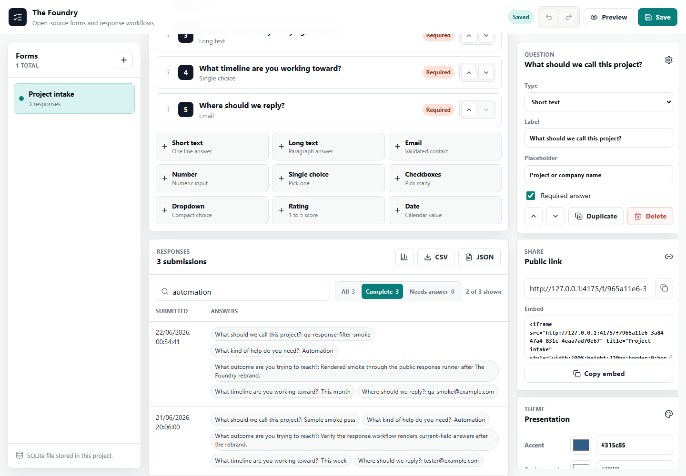
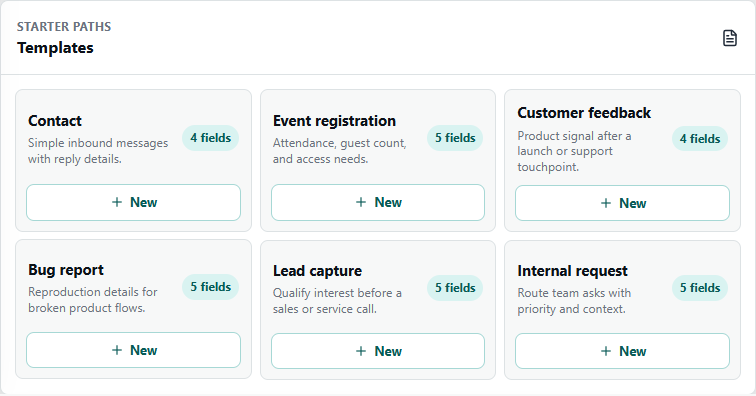
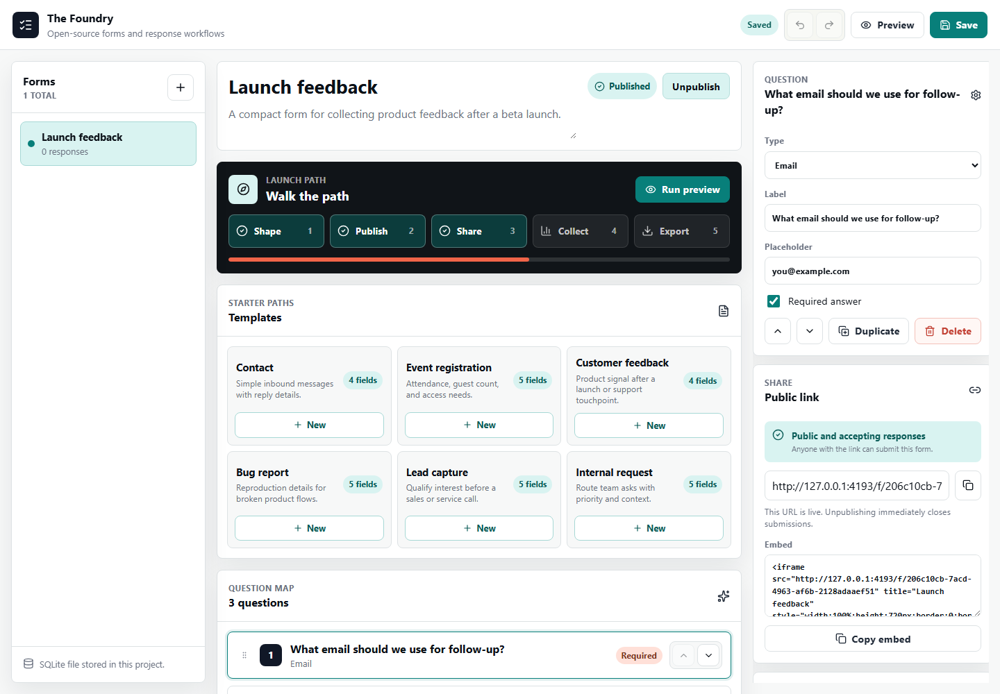
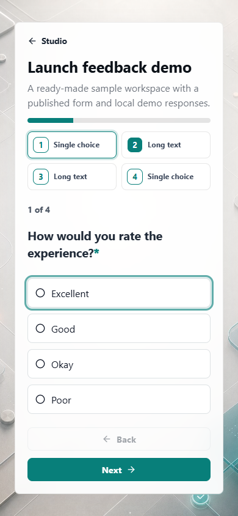

# The Foundry

The Foundry is a source-available, self-hosted forms and response workflow studio.
It is built for people who want Typeform-style polish without response caps,
vendor lock-in, or handing their data to another subscription service.



## What It Does

- Build forms with short text, long text, email, number, choice, rating, and date fields
- Start from common templates for contact, events, feedback, bugs, leads, and internal requests
- Open a demo workspace with sample responses for first-run testing
- Reorder questions with keyboard-friendly controls and drag handles
- Publish controlled public form links and iframe embeds
- Preview live, draft, and compact public runner states before sharing
- Guide users through draft, launch, sharing, and response review
- Collect responses into local SQLite storage
- Search and filter collected responses
- Select and bulk-delete responses during local cleanup
- Export responses as CSV or structured JSON
- Import and export full form definitions between installs
- Tune success and closed-form messages for public visitors
- Configure webhook delivery for downstream workflows
- Inspect storage, environment, and default form settings in the admin UI
- Run locally, on a small server, or in Docker

## Screenshots







## Quick Start

Install dependencies, build the frontend, and run the server:

```powershell
npm install
npm run build
npm run start
```

The app runs at:

```text
http://127.0.0.1:4174
```

For local development with Vite:

```powershell
npm run dev
```

## First Five Minutes

1. Open the demo workspace to see a published form with sample responses, or
   create a form from a starter template.
2. Pick a theme preset, check the draft or compact preview, then publish it.
3. Open the live public runner from the sharing panel and submit a test response.
4. Return to the admin view, search or filter responses, then export visible
   rows as CSV or JSON.
5. Select test responses and delete them when the trial run is finished.

For a fuller first-tester pass, see [TESTING.md](TESTING.md).

## Data Storage

By default, The Foundry stores data in:

```text
.data/openforms.sqlite
```

Set `OPENFORMS_DATA_DIR` to use another directory:

```powershell
$env:OPENFORMS_DATA_DIR = "D:\foundry-data"
npm run serve
```

The legacy `OPENFORMS_DATA_DIR` name and `openforms.sqlite` filename are kept
for compatibility with existing local installs.

The admin Operations panel shows the active SQLite mode, data directory,
database file, bind address, port, and default new-form colors.

## Form Definitions

Use the Definition panel in the admin UI to export a form as portable JSON or
import a JSON definition as a new draft. Definition exports include form copy,
mode, colors, and questions. They intentionally omit responses and webhook URLs
so demo files can be shared without collected data or private delivery targets.

## Docker

Build and run with Docker Compose:

```powershell
docker compose up --build
```

Or build and run the production image directly:

```powershell
docker build -t the-foundry:local .
docker run --rm -p 4174:4174 -v foundry-data:/data the-foundry:local
```

The container serves the app on:

```text
http://127.0.0.1:4174
```

Docker stores SQLite data in the `foundry-data` volume mounted at `/data`.
The public GHCR image is available as:

```text
ghcr.io/martin123132/the-foundry:v0.1.0
```

Pull and run it directly:

```powershell
docker pull ghcr.io/martin123132/the-foundry:v0.1.0
docker run --rm -p 4174:4174 -v foundry-data:/data ghcr.io/martin123132/the-foundry:v0.1.0
```

The first published image also has an immutable commit SHA tag:

```text
ghcr.io/martin123132/the-foundry:cbaab6b4f130d3d13e4ae57c7772d272e95d5078
```

No `latest` tag is published yet. See
[docs/DOCKER_PUBLISHING.md](docs/DOCKER_PUBLISHING.md) for the guarded release
policy, dry-run workflow, and future publish runbook. Publication remains
controlled with the repository variable:

```text
DOCKER_PUBLISH_ENABLED=true
```

## Deployment

See [DEPLOYMENT.md](DEPLOYMENT.md) for production notes, environment variables,
Docker hosting, reverse proxy guidance, and backup targets.

## Changelog

See [CHANGELOG.md](CHANGELOG.md) for release notes, published Docker image tags,
and current unreleased changes.

## Testing

Use [TESTING.md](TESTING.md) for a manual first-tester checklist and the local
validation commands. CI runs lint, build, first-tester smoke, accessibility
smoke, Docker publishing policy checks, and Docker build/run smoke.

## Deployment Notes

The server is a small Node app that serves the built React frontend and owns the
SQLite database. For a production deployment:

- Run `npm run build` before `npm run start`
- Set `PORT` if your host assigns one
- Set `OPENFORMS_DATA_DIR` to a persistent disk
- Put the app behind HTTPS
- Back up the SQLite database regularly

## Scripts

```text
npm run dev      Start the Vite dev server
npm run build    Type-check and build the frontend
npm run lint     Run ESLint
npm run test:smoke Run first-tester rendered workflow smoke checks
npm run test:a11y Run rendered Playwright/axe accessibility smoke checks
npm run start    Start the production Node server
npm run serve    Build, then start the production server
```

## Roadmap

- v0.1.1 first-tester polish and release-readiness cleanup
- Optional future Docker image publish policy update for `latest`
- Additional response reporting and summary views

## License

The Foundry is available for personal and non-commercial use under the
PolyForm Noncommercial License 1.0.0. Commercial use requires a separate
written license from TWO HANDS NETWORK LTD.

See [LICENSE](LICENSE), [NOTICE.md](NOTICE.md), and
[COMMERCIAL-LICENSE.md](COMMERCIAL-LICENSE.md). Commercial licensing discussions
should be directed to the COO of TWO HANDS NETWORK LTD.
